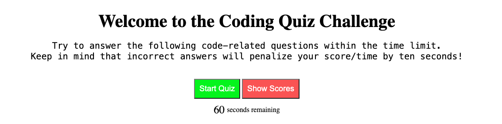

# JavaScript Quiz

## Description

Test your knowledge of JavaScript with this awesome quiz app! I made this app so that you can quickly test your or your student's knowledge of JavaScript principals. By making this app it allowed me to practice my own knowledge of JavaScript and lessons learned in coding class. 

## Table of Contents

- [Installation](#Installation)
- [Useage](#Useage)
- [Credits](#Credits)
- [License](#License)
- [Questions](#Questions)

## Installation

Visit the deployed website:

https://coulterkyle.github.io/javascript-quiz/

## Useage

Upon visiting the site you will be presented with a homescreen welcome page that informs you of the rules of the quiz.

Click the start button and take the test!
Try to answer the following code-related questions within the time limit.
Keep in mind that incorrect answers will penalize your score/time by ten seconds!

After taking the test - enter your initials to record your score and compare against others who have taken the test on your machine!

## Credits

Thank you to my bootcamp instructors, Roger and Sasha for the instruction that allowed me to build my app.

## License

No license

## Questions

https://github.com/coulterkyle

For questions regarding this app, contact me at:

e-mail: kcoulter2002@gmail.com
